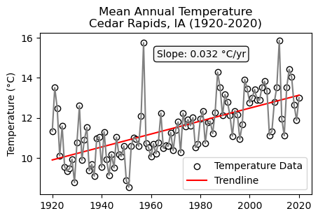

<!--
## HERE ARE OTHER IMAGES TO USE ##

***

-->

## Education Director ([Earth Lab](https://earthlab.colorado.edu/our-team/nathan-quarderer)/ [ESIIL](https://esiil.org/our-team))
* Email: <a href="mailto:naqu1888@colorado.edu">Nate's email</a>
* <a href="https://docs.google.com/document/d/1UZNcXSnRnsQ-Uz3WoSa-JrKID7YULzRT/edit?usp=sharing&ouid=114384468148649901473&rtpof=true&sd=true" target="_blank">Curriculum vitae</a>
* <a href="https://www.linkedin.com/in/nathan-quarderer-69726b191/" target="_blank">LinkedIn</a>
* Twitter: <a href="https://twitter.com/nquarderer" target="_blank">@nquarderer</a>
* GitHub: <a href="https://github.com/nquarder" target="_blank">@nquarder</a>
* ORCiD: <a href="https://orcid.org/0000-0001-6602-3174" target="_blank">0000-0001-6602-3174</a>
* <a href="https://scholar.google.com/citations?user=JmH0MMIAAAAJ&hl=en&authuser=1" target="_blank">Google Scholar</a>

Hi everyone! My name is Nate Quarderer and I'm Education Director at <a href="https://earthlab.colorado.edu/" target="_blank">**Earth Lab**</a> and the Environmental Data Science Innovation & Inclusion Lab (<a href="https://esiil.org/" target="_blank">**ESIIL**</a>) at the <a href="https://www.colorado.edu/" target="_blank">**University of Colorado Boulder**</a>. 

Prior to my roles here at Earth Lab and ESIIL, I spent 10 years teaching physics, math, and environmental science at <a href="https://www.nicc.edu/" target="_blank">**Northeast Iowa Community College**</a>. I did my PhD in Teaching & Learning (Science Education) at the <a href="https://www.uiowa.edu/" target="_blank">**University of Iowa**</a> where I studied <a href="https://iro.uiowa.edu/esploro/outputs/9983949497702771?institution=01IOWA_INST&skipUsageReporting=true&recordUsage=false" target="_blank">**how 8th graders come to know about climate change**</a>. 

Since coming to CU as a postdoc in 2020, I was involved with the <a href="https://earthlab.colorado.edu/edsc" target="_blank">**Earth Data Science Corps (EDSC)**</a> program where I served as lead instructor. I'm now overseeing the <a href="https://esiil.org/esiil-stars" target="_blank">**ESIIL Stars**</a> internship, modeled after the ESDC, and the ESIIL <a href="https://esiil.org/data-short-course" target="_blank">**Data Short Course**</a>.

***

### Check out some of my work:
* [**Wausau, WI precipitation 1943-2023**](https://nquarder.github.io/notebooks/wausau-precip.html)

* [**Iowa River discharge 1903-2023**](https://nquarder.github.io/notebooks/08-iowa-flood.html)

* [**Arctic temperature anomalies in April 1850-2023**](https://nquarder.github.io/notebooks/arctic-temp-april.html)

* [**NDVI Changes at Cedar Rapids, IA - 2020 Derecho**](https://github.com/nquarder/nquarder.github.io/blob/main/notebooks/cr-derecho.ipynb)

* [**NDVI Changes at Newbold, WI - 2010-2022**](https://github.com/nquarder/nquarder.github.io/blob/main/notebooks/newbold-ndvi.ipynb)

* [**Landuse at Puerto Asís, Colombia 2002**](https://github.com/earthlab-education/04-geopark-raster-data/blob/main/notebooks/04-geopark-raster-data-solutions.ipynb)

* [**July high temperatures Danmarkshavn, Greenland (1983-2024)**](https://github.com/nquarder/nquarder.github.io/blob/main/notebooks/ncei-api-demo.ipynb)

* [**Interactive map of Kirkwood Community College in Cedar Rapids, IA**](https://github.com/nquarder/first-map-template/blob/main/first-map.ipynb)
<embed type="text/html" src="/img/cr.html" width="600" height="600">

* [**Annual Mean Temperature, Boulder, CO 1983-2023**](https://nquarder.github.io/notebooks/01-time-series-boulder.html)

* [**Annual Mean Temperature, Cedar Rapids, IA 1920-2020**](https://nquarder.github.io/notebooks/01-time-series-cedar-rapids.html)

